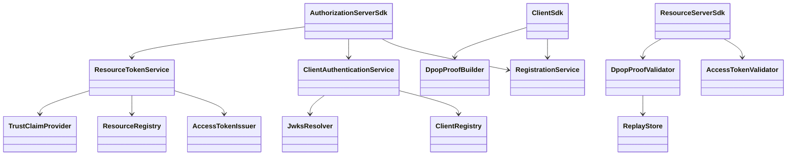

# Core Class Model

```mermaid
classDiagram
    class ClientSdk
    class AuthorizationServerSdk
    class ResourceServerSdk
    class RegistrationService
    class ClientAuthenticationService
    class ResourceTokenService
    class AccessTokenIssuer
    class AccessTokenValidator
    class DpopProofBuilder
    class DpopProofValidator
    class JwksResolver
    class ReplayStore
    class ClientRegistry
    class ResourceRegistry
    class TrustClaimProvider

    ClientSdk --> RegistrationService
    ClientSdk --> DpopProofBuilder
    AuthorizationServerSdk --> RegistrationService
    AuthorizationServerSdk --> ClientAuthenticationService
    AuthorizationServerSdk --> ResourceTokenService
    ResourceTokenService --> AccessTokenIssuer
    ResourceTokenService --> ResourceRegistry
    ResourceTokenService --> TrustClaimProvider
    ResourceServerSdk --> AccessTokenValidator
    ResourceServerSdk --> DpopProofValidator
    DpopProofValidator --> ReplayStore
    ClientAuthenticationService --> ClientRegistry
    ClientAuthenticationService --> JwksResolver
```
