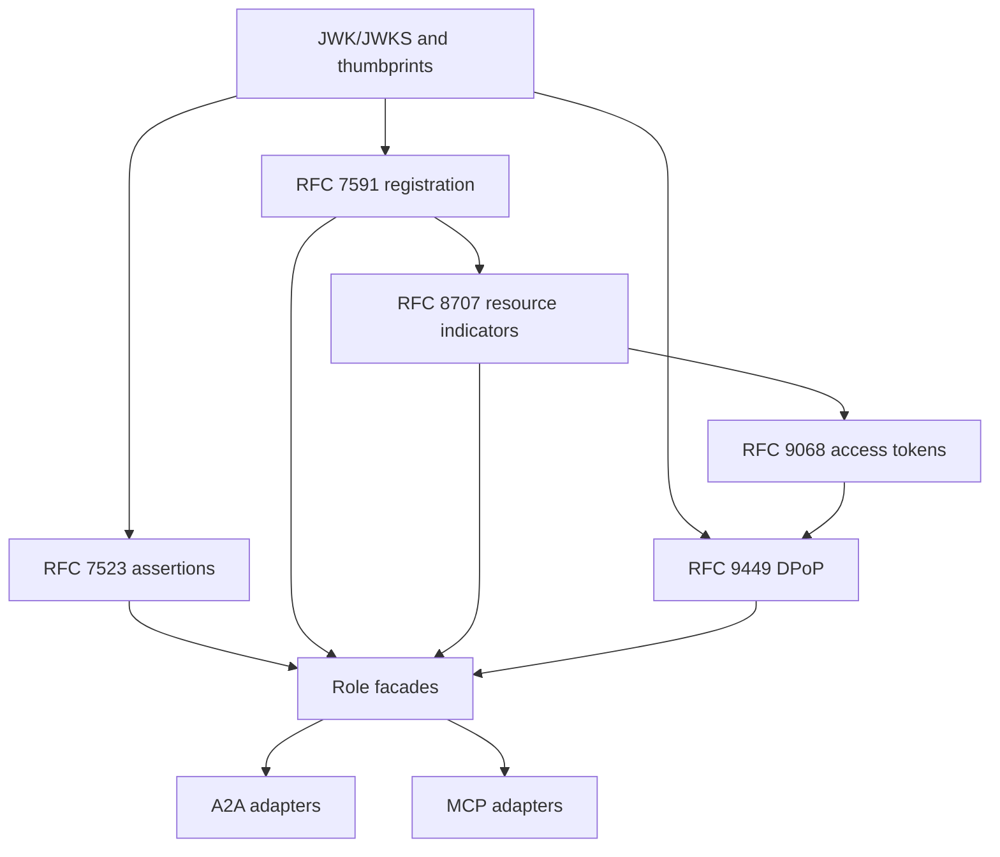

# Dependency Graph

```mermaid
flowchart TD
    J[JWK/JWKS and thumbprints] --> A[RFC 7523 assertions]
    J --> R[RFC 7591 registration]
    R --> RI[RFC 8707 resource indicators]
    RI --> AT[RFC 9068 access tokens]
    J --> D[RFC 9449 DPoP]
    AT --> D
    A --> F[Role facades]
    R --> F
    RI --> F
    D --> F
    F --> A2A[A2A adapters]
    F --> MCP[MCP adapters]
```

Dependencies point inward toward stable protocol primitives and ports. Product code may depend on public facades but the SDK never depends on product repositories.
