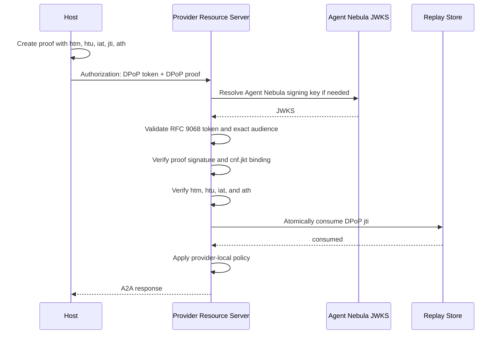

# DPoP Provider Invocation

```mermaid
sequenceDiagram
    participant H as Host
    participant P as Provider Resource Server
    participant J as Agent Nebula JWKS
    participant R as Replay Store

    H->>H: Create proof with htm, htu, iat, jti, ath
    H->>P: Authorization: DPoP token + DPoP proof
    P->>J: Resolve Agent Nebula signing key if needed
    J-->>P: JWKS
    P->>P: Validate RFC 9068 token and exact audience
    P->>P: Verify proof signature and cnf.jkt binding
    P->>P: Verify htm, htu, iat, and ath
    P->>R: Atomically consume DPoP jti
    R-->>P: consumed
    P->>P: Apply provider-local policy
    P-->>H: A2A response
```
