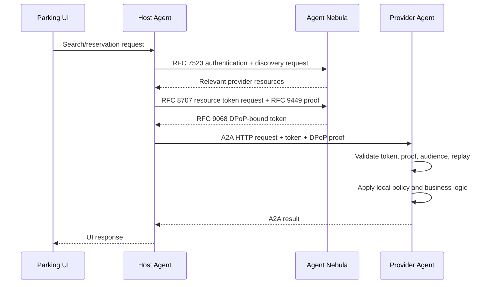

# End-to-End Host → Registry → Provider

```mermaid
sequenceDiagram
    participant UI as Parking UI
    participant H as Host Agent
    participant N as Agent Nebula
    participant P as Provider Agent

    UI->>H: Search/reservation request
    H->>N: RFC 7523 authentication + discovery request
    N-->>H: Relevant provider resources
    H->>N: RFC 8707 resource token request + RFC 9449 proof
    N-->>H: RFC 9068 DPoP-bound token
    H->>P: A2A HTTP request + token + DPoP proof
    P->>P: Validate token, proof, audience, replay
    P->>P: Apply local policy and business logic
    P-->>H: A2A result
    H-->>UI: UI response
```
