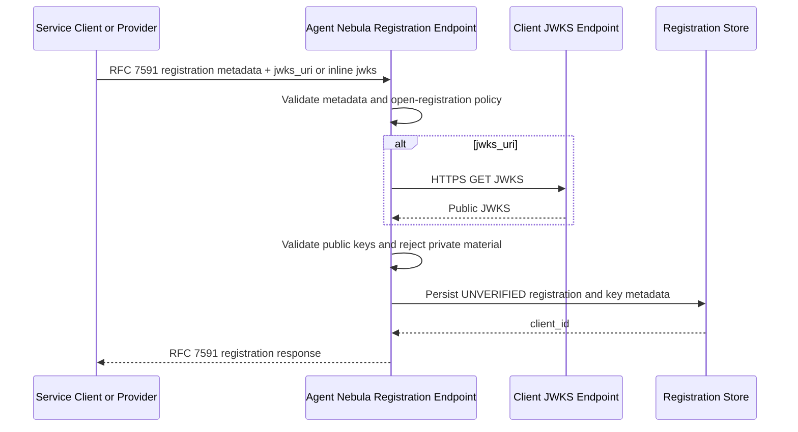

# Open Registration Flow

```mermaid
sequenceDiagram
    participant E as Service Client or Provider
    participant R as Agent Nebula Registration Endpoint
    participant J as Client JWKS Endpoint
    participant S as Registration Store

    E->>R: RFC 7591 registration metadata + jwks_uri or inline jwks
    R->>R: Validate metadata and open-registration policy
    alt jwks_uri
      R->>J: HTTPS GET JWKS
      J-->>R: Public JWKS
    end
    R->>R: Validate public keys and reject private material
    R->>S: Persist UNVERIFIED registration and key metadata
    S-->>R: client_id
    R-->>E: RFC 7591 registration response
```

Open registration establishes a cryptographic client identity but not enterprise trust. Trust scoring records the registration profile without changing protocol behavior.
