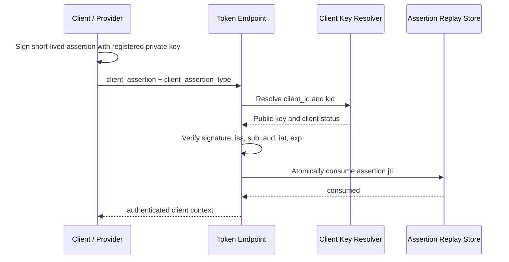

# RFC 7523 Client Authentication

```mermaid
sequenceDiagram
    participant C as Client / Provider
    participant T as Token Endpoint
    participant K as Client Key Resolver
    participant P as Assertion Replay Store

    C->>C: Sign short-lived assertion with registered private key
    C->>T: client_assertion + client_assertion_type
    T->>K: Resolve client_id and kid
    K-->>T: Public key and client status
    T->>T: Verify signature, iss, sub, aud, iat, exp
    T->>P: Atomically consume assertion jti
    P-->>T: consumed
    T-->>C: authenticated client context
```
