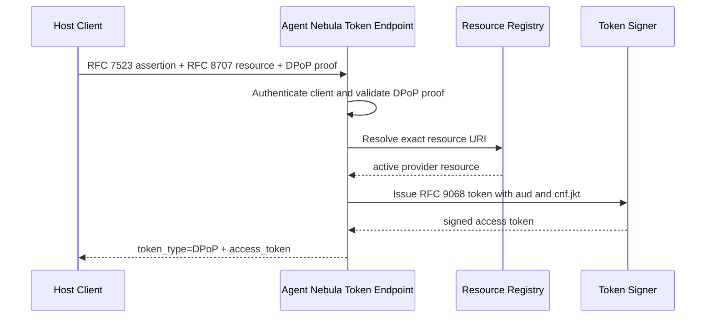

# Resource Token Flow

```mermaid
sequenceDiagram
    participant H as Host Client
    participant N as Agent Nebula Token Endpoint
    participant RR as Resource Registry
    participant TS as Token Signer

    H->>N: RFC 7523 assertion + RFC 8707 resource + DPoP proof
    N->>N: Authenticate client and validate DPoP proof
    N->>RR: Resolve exact resource URI
    RR-->>N: active provider resource
    N->>TS: Issue RFC 9068 token with aud and cnf.jkt
    TS-->>N: signed access token
    N-->>H: token_type=DPoP + access_token
```
